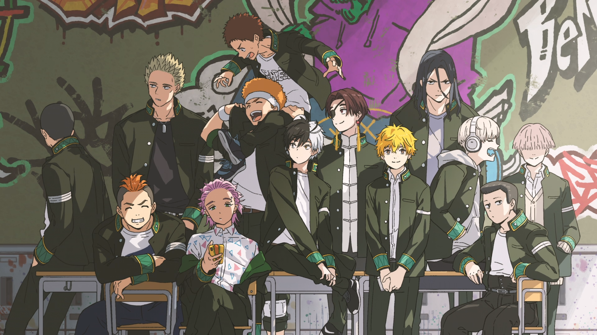

## Hi there 👋

  

)

Soy un apasionado del aprendizaje, especialmente en el mundo de la programación. Actualmente, me estoy adentrando en el desarrollo de aplicaciones utilizando Java y MySQL. Dirijo una comunidad en Discord donde todos los entusiastas de la programación pueden unirse, hacer amigos y aprender juntos. En el futuro, me gustaría impartir clases de programación y compartir mis conocimientos con otros. ¡Siempre hay espacio para nuevos aprendices y experiencias compartidas!

## TECNOLOGIAS

<!-- BEGIN YOUTUBE-CARDS -->
<!-- END YOUTUBE-CARDS -->

<!--
**Guiilla/Guiilla** is a ✨ _special_ ✨ repository because its `README.md` (this file) appears on your GitHub profile.

Here are some ideas to get you started:

- 🔭 I’m currently working on ...
- 🌱 I’m currently learning ...
- 👯 I’m looking to collaborate on ...
- 🤔 I’m looking for help with ...
- 💬 Ask me about ...
- 📫 How to reach me: ...
- 😄 Pronouns: ...
- ⚡ Fun fact: ...
-->
